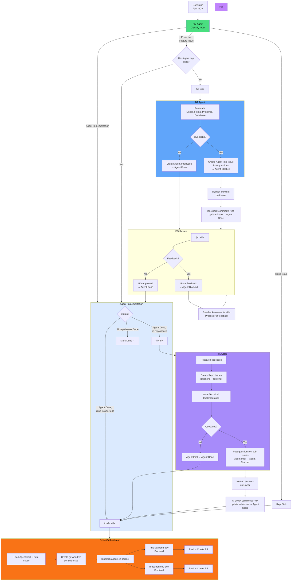

# Agent Pipeline

## Flow Diagram

```mermaid
flowchart TD
    User["User runs /pm &lt;ID&gt;"]

    %% ── Step 0–1: Parse & Classify ──
    User --> PM["PM Agent<br/>Classify Input"]
    PM -->|Project URL| ProjectMode
    PM -->|"Title: * - Slices"| SlicesParent
    PM -->|"Title: * - Agent Implementation"| AgentImpl
    PM -->|"Title: Slice N: *"| Slice
    PM -->|"Parent is Agent Impl"| RepoSub
    PM -->|"Has project w/ structure"| ProjectMode
    PM -->|"No match"| FeatureIssue

    %% ── Step 2: Project Mode ──
    subgraph ProjectMode["Project Mode"]
        P1{"Has issues?"}
        P1 -->|No| BA_Bootstrap["/ba &lt;projectId&gt;<br/>Bootstrap new project"]
        P1 -->|"Found * - Slices"| GoSlices["→ Slices Parent"]
        P1 -->|"Found * - Agent Impl"| GoAgentImpl["→ Agent Implementation"]
    end

    %% ── Step 2S: Feature Issue ──
    subgraph FeatureIssue["Feature Issue Mode"]
        S1{"Has children?"}
        S1 -->|No| BA_Feature["/ba &lt;issueId&gt;<br/>Create Agent Impl"]
        S1 -->|"Agent Impl child"| GoAgentImpl2["→ Agent Implementation"]
        S1 -->|"Slices child"| GoSlices2["→ Slices Parent"]
        S1 -->|All children Done| MarkDone["Mark issue Done"]
    end

    %% ── Step 3: Slices Parent ──
    subgraph SlicesParent["Slices Parent"]
        SP1{"Status?"}
        SP1 -->|Todo / No children| BA_Slice["/ba-slice-issue &lt;id&gt;<br/>Create slices"]
        SP1 -->|Agent Blocked| SP_Check{"Answers<br/>received?"}
        SP_Check -->|Yes| BA_CheckSlice["/ba-check-comments &lt;id&gt;"]
        SP_Check -->|No| SP_Wait["Waiting for answers"]
        SP1 -->|Agent Done| SP_Process["Process each Slice<br/>(dependency order)"]
    end

    SP_Process --> Slice

    %% ── Step 5: Slice ──
    subgraph Slice["Slice"]
        SL1{"Has Agent Impl<br/>child?"}
        SL1 -->|No| BA_Analyze_Slice["/ba &lt;sliceId&gt;<br/>Create Agent Impl"]
        SL1 -->|Yes| GoAgentImpl3["→ Agent Implementation"]
        SL1 -->|All children Done| MarkSliceDone["Mark slice Done"]
    end

    %% ── Step 4: Agent Implementation ──
    subgraph AgentImpl["Agent Implementation"]
        AI1{"Status?"}
        AI1 -->|Todo| BA_Analyze["/ba &lt;id&gt;<br/>Write business spec"]
        AI1 -->|Agent Working| AI_Skip["Skip — in progress"]
        AI1 -->|Agent Blocked| AI_Check{"Answers<br/>received?"}
        AI_Check -->|Yes| BA_Check["/ba-check-comments &lt;id&gt;"]
        AI_Check -->|No| AI_Wait["Waiting for answers"]
        AI1 -->|Agent Done| AI_Children{"Has Repo<br/>Issues?"}
        AI_Children -->|No| AI_PO{"PO reviewed?"}
        AI_PO -->|No| PO_Check["/po &lt;id&gt;<br/>PO reviews issue"]
        AI_PO -->|Yes| TL["/tl &lt;id&gt;<br/>Create repo issues"]
        AI_Children -->|"Yes, all Done"| MarkAIDone["Mark Agent Impl Done"]
        AI_Children -->|"Yes, any Todo"| Code["/code &lt;id&gt;<br/>Dispatch engineers"]
        AI_Children -->|"Yes, in progress"| AI_CodeRunning["Skip — code running"]
        AI_Children -->|"Yes, any Blocked"| GoRepoSub["→ Repo Issue"]
    end

    %% ── Step 6: Repo Issue ──
    subgraph RepoSub["Repo Issue"]
        RS1{"Status?"}
        RS1 -->|Todo| Code2["/code &lt;agentImplId&gt;<br/>Dispatch engineers"]
        RS1 -->|In Progress / Working| RS_Skip["Skip — in progress"]
        RS1 -->|Agent Blocked| RS_Check{"Answers<br/>received?"}
        RS_Check -->|Yes| TL_Check["/tl-check-comments &lt;id&gt;"]
        RS_Check -->|No| RS_Wait["Waiting for answers"]
        RS1 -->|Agent Done| RS_Review["Ready for review"]
        RS1 -->|Done| RS_Done["Completed"]
    end

    %% ── Code Orchestrator detail ──
    Code --> CodeOrch
    Code2 --> CodeOrch
    subgraph CodeOrch["/code Orchestrator"]
        CO1["Load Agent Impl + Sub-Issues"]
        CO1 --> CO2["Create git worktree per sub-issue"]
        CO2 --> CO3["Dispatch agents in parallel"]
        CO3 --> BE["rails-backend-dev<br/>Backend"]
        CO3 --> FE["react-frontend-dev<br/>Frontend"]
        BE --> PR1["Push + Create PR"]
        FE --> PR2["Push + Create PR"]
    end

    %% ── BA Agent detail ──
    BA_Bootstrap --> BA_Agent
    BA_Feature --> BA_Agent
    BA_Analyze --> BA_Agent
    BA_Analyze_Slice --> BA_Agent
    subgraph BA_Agent["BA Agent (/ba)"]
        BA1["Research: Linear, Figma,<br/>Prototype, Codebase"]
        BA1 --> BA2{"Questions?"}
        BA2 -->|No| BA3["Create Agent Impl issue<br/>Status → Agent Done"]
        BA2 -->|Yes| BA4["Create Agent Impl issue<br/>Post questions comment<br/>Status → Agent Blocked"]
    end

    %% ── BA Slice Agent detail ──
    BA_Slice --> BA_SliceAgent
    subgraph BA_SliceAgent["BA Agent (/ba-slice-issue)"]
        BSA1["Research: Linear, Figma,<br/>Prototype, Codebase"]
        BSA1 --> BSA2["Create Slices parent +<br/>Slice child issues"]
        BSA2 --> BSA3{"Questions?"}
        BSA3 -->|No| BSA4["Status → Agent Done"]
        BSA3 -->|Yes| BSA5["Post questions<br/>Status → Agent Blocked"]
    end

    %% ── TL Agent detail ──
    TL --> TL_Agent
    subgraph TL_Agent["TL Agent (/tl)"]
        TL1["Read Agent Impl +<br/>Research codebase"]
        TL1 --> TL2["Create Repo Issues<br/>(Backend, Frontend)"]
        TL2 --> TL3["Write Technical Implementation<br/>in each sub-issue"]
        TL3 --> TL4{"Questions?"}
        TL4 -->|No| TL5["Agent Impl → Agent Done"]
        TL4 -->|Yes| TL6["Post questions on sub-issues<br/>Agent Impl → Agent Blocked"]
    end

    %% ── Styling ──
    style PM fill:#4ade80,color:#000
    style BA_Agent fill:#60a5fa,color:#000
    style BA_SliceAgent fill:#60a5fa,color:#000
    style PO_Check fill:#c084fc,color:#000
    style TL_Agent fill:#a78bfa,color:#000
    style CodeOrch fill:#f97316,color:#000
    style ProjectMode fill:#f1f5f9,color:#000
    style FeatureIssue fill:#f1f5f9,color:#000
    style SlicesParent fill:#fef3c7,color:#000
    style Slice fill:#fef3c7,color:#000
    style AgentImpl fill:#dbeafe,color:#000
    style RepoSub fill:#ede9fe,color:#000
```



## Commands

| Command | Agent | Purpose |
|---------|-------|---------|
| `/pm <ID> [--ba=analyze\|slice] [--design=direct\|brainstorm]` | PM | Classify input, determine next action, output commands |
| `/ba <ID>` | BA | Write business requirements into Agent Implementation issue |
| `/ba-slice-issue <ID>` | BA | Break large feature into independently deployable slices |
| `/po <ID>` | PO | Review Agent Implementation issue, answer BA questions, provide feedback |
| `/ba-check-comments <ID>` | BA | Read human answers on blocked issues and update |
| `/tl <ID>` | TL | Create Repo Issues with technical implementation specs |
| `/tl-check-comments <ID>` | TL | Read answers on blocked sub-issues and update |
| `/tl-design <ID>` | TL | Design database architecture for Slice 0 (direct best solution) |
| `/tl-design-brainstorm <ID>` | TL | Brainstorm database architecture for Slice 0 (two approaches, naming options, questions for discussion) |
| `/tl-design-finalize <ID>` | TL | Finalize a brainstorm into a single architecture (converges discussion into `## Architecture Design`) |
| `/code <agentImplId>` | Code Orchestrator | Create worktrees, dispatch implementation agents, create PRs |

## Status Lifecycle

```
Agent Implementation:   Todo → Agent Working → Agent Blocked ⇄ Agent Working → Agent Done → Done
Slices Parent:          Todo → Agent Working → Agent Blocked ⇄ Agent Working → Agent Done
Slice (0):              Todo → Agent Working → Agent Blocked ⇄ Agent Working → Agent Done → Done
Slice (1+):             Todo → ... → Done (when all children done)
Repo Issue:         Todo → In Development → Done
```

## Structures

**Direct** (small features):
```
Issue/Project → Agent Implementation → Repo Issues (Backend, Frontend)
```

**Slices** (large features):
```
Issue/Project → Slices Parent → Slice 0 → Agent Implementation → Repo Issues
                              → Slice 1 → Agent Implementation → Repo Issues (feature slices start at 1)
                              → Slice N → ...
```

## Simplified Flow (Direct — no Slices)


