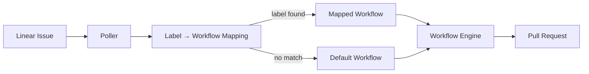
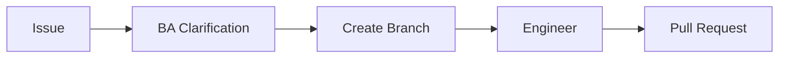

# iron-press

An orchestrator that drives [Claude Agent SDK](https://github.com/anthropics/claude-agent-sdk) pipelines as configurable directed graphs. Picks up issues from Linear, runs them through a workflow of AI-agent nodes, and opens pull requests — fully automated.

Control flow is a **directed graph of nodes** (Graphology), not an LLM dispatcher — the same workflow produces the same traversal every time. SDK structured output locks every node's return to `Pass`, `Fail`, or `WaitUserInput`, which the engine maps onto outgoing edges.

## Architecture



Workflows are directed graphs. The default `simple` workflow:



## Install

```bash
pnpm install
cp .env.example .env
cp iron-press.config.json.example iron-press.config.json
# fill in LINEAR_API_KEY (required unless DEV_MODE=1)
```

### Anthropic auth

`ANTHROPIC_API_KEY` is **optional**. If you're logged in to Claude Code (`claude login`), the Agent SDK reuses those OAuth credentials and bills against your Pro/Max/Team subscription. Set the key only for pay-as-you-go API credits. Verify with `claude /status`.

## Run

```bash
pnpm do <issueId>                        # default workflow on a Linear issue
pnpm do <workflowName> <issueId>         # specific workflow
pnpm do ENG-534 --cwd /path/to/repo      # set the SDK session cwd
pnpm do ENG-534 --run-id 20260423-xyz    # reuse an existing .runs/<id> directory
pnpm do --poll                           # poll Linear continuously for new issues
```

## Configuration

`iron-press.config.json` controls polling and workflow selection:

```json
{
  "defaultWorkflow": "simple",
  "workflowMapping": {
    "feature": "simple",
    "bug": "sm"
  },
  "linear": {
    "teamId": "YOUR_TEAM_ID",
    "pollIntervalMs": 30000,
    "includeStatuses": ["Backlog"],
    "excludeStatuses": ["Done", "Canceled"]
  },
  "repository": {
    "url": "git@github.com:owner/repo.git",
    "baseBranch": "main",
    "branchPrefix": "issue-"
  }
}
```

| Field | Description |
|-------|-------------|
| `defaultWorkflow` | Workflow used when no label matches (overrides the built-in `"simple"` default). |
| `workflowMapping` | Maps Linear label names → workflow names. First matching label wins; unknown workflows log a warning and fall through to `defaultWorkflow`. |
| `linear` | Polling settings: team/project, interval, status filters. |
| `repository` | Auto-clone target for poll mode. |

Available workflows are listed in `src/sdk/workflow/registry.ts`. Built-in: `simple` (BA → Eng), `sm` (BA → human review → Eng).

## Exit codes

| Code | Meaning |
|------|---------|
| 0 | `Pass` — workflow reached a node with no matching outgoing edge |
| 1 | `Fail` — a node returned `Fail`, or the run errored |
| 2 | `WaitUserInput` — a node suspended pending human input (resumable via `--run-id`) |

## Layout

```
src/
├── index.ts                  CLI entry (commander) → engine.run()
├── config.ts                 .env loader, workspace paths, sensitive keywords, retry policy
├── sdk/
│   ├── workflow/             Graphology engine, builder, contracts, workflow registry
│   ├── node/                 AgentNode base class + tool-call hooks
│   └── session/              SDK query() wrapper + stable UUIDv5 session ids
├── workflows/
│   ├── simple/               BA clarification → branch → eng → PR
│   └── sm/                   BA → human review → worktree → eng → PR
├── github/                   Octokit client for issue/PR reads
├── runs/run-log.ts           .runs/<runId>/ artifact manager
├── types/contracts.ts        Zod schemas
└── util/                     logger, retry, skill-loader, extract-json

tests/
├── state/                    [legacy] tests against pre-rewrite src/state/ — see LEGACY.md
├── planner/                  [legacy] broken — imports deleted src/planner/
├── workflow/                 [legacy] broken — imports deleted src/workflow/ (now src/sdk/workflow/)
└── ui/                       passing — helpers for ui/

ui/                           monitoring UI (tsx ui/server.ts)
```

## Studio UI

The orchestrator includes a visual, node-based workflow editor ("Studio") built with React and React Flow. It allows you to:

- Visually design workflows (Left-to-Right DAG layout).
- Configure node parameters via the Inspector (Model, Max Turns, Budget, Allowed/Disallowed tools).
- Connect edges between nodes based on SDK statuses (`Pass`, `Fail`, `WaitUserInput`).
- View and manage your workflow definitions interactively without writing code.

**To run the Studio UI:**
```bash
pnpm ui
```
This spawns a proxy server on port `4455` and serves the frontend. The CLI will automatically open `http://localhost:4455/studio` in your browser.

## Workflow engine

`src/sdk/workflow/` — a typed, Graphology-backed engine. Nodes are connected by **status-labeled edges**.

### Statuses

Every node's `execute` returns one of:

| Status | Meaning |
|--------|---------|
| `Pass` | Succeeded — follow the `Pass` edge to the next node |
| `Fail` | Failed — follow the `Fail` edge, or end the run if none exists |
| `WaitUserInput` | Suspend — run ends immediately (no edge lookup) |

### Node interface

```ts
interface Node<TState> {
  id: string;
  name: string;
  onEnter?: (ctx: NodeContext<TState>) => Promise<void>;
  execute:  (ctx: NodeContext<TState>) => Promise<{ status: NodeStatus }>;
  onExit?:  (ctx: NodeContext<TState>, status: NodeStatus) => Promise<void>;
}
```

`ctx.state` is shared and mutable — handlers write to it in place.

### Building and running

```ts
import { WorkflowBuilder, GraphologyEngine } from "@/sdk/workflow";

type State = { result: string };

const workflow = new WorkflowBuilder<State>()
  .addNode({
    id: "fetch", name: "Fetch data",
    execute: async (ctx) => {
      ctx.state.result = await fetchSomething();
      return { status: "Pass" };
    },
  })
  .addNode({
    id: "save", name: "Save result",
    execute: async (ctx) => {
      await save(ctx.state.result);
      return { status: "Pass" };
    },
  })
  .addEdge("fetch", "save", "Pass")
  .setInitialNode("fetch")
  .build();

const result = await new GraphologyEngine<State>().run(
  workflow,
  { result: "" },
  { onTerminate: (r) => console.log(r.finalStatus) },
);
```

## Agent nodes

`AgentNode<TState>` (in `src/sdk/node/`) is the base class for SDK-backed nodes. It owns:

1. Opening a stage directory via `RunLog.openStage({ kind, issueId })`.
2. Deriving a deterministic UUIDv5 session id from `(runId, role, issueId, stageIndex)`.
3. Running one `query()` with structured output locked to `{ status: "Pass"|"Fail"|"WaitUserInput" }`.
4. Writing `prompt.md`, `transcript.jsonl`, `tool-calls.jsonl`, `stderr.log`, `result.json`.

Concrete nodes pass an `AgentNodeConfig` to the super constructor — they don't override `execute`. See `src/workflows/simple/nodes/ba/index.ts` for the reference pattern.

### Node folder convention

```
src/workflows/<workflow>/nodes/<node>/
├── index.ts        — class extends AgentNode
├── skill.md        — user prompt template ({{issueId}} is substituted)
└── permissions.ts  — allowedTools, disallowedTools, canUseTool
```

Permissions ship **next to the node**, not in a global config.

## Run artifacts

Every run writes to `.runs/<runId>/`:

```
.runs/<runId>/
├── events.ndjson                          run-level event log
├── meta.json                              run metadata
└── stages/NNNN-<role>-<issue>/            one directory per SDK session
    ├── prompt.md
    ├── transcript.jsonl
    ├── tool-calls.jsonl
    ├── stderr.log
    └── result.json                        { status, sessionId, costUsd, tokens }
```

Run id format: `YYYYMMDD-HHmmss-<rand>` (local time), so `ls` sorts chronologically.

## Tests

```bash
pnpm test
```

All suites pass: workflow engine, agent nodes, create-branch node, pull-request node, UI helpers.

## Scripts

```bash
pnpm do <args>          # run a workflow (see Run)
pnpm build              # compile TypeScript → dist/
pnpm typecheck          # type-check only
pnpm test               # vitest run
pnpm test:watch         # vitest watch
pnpm ui                 # monitoring UI
pnpm ui:typecheck       # type-check the UI project
```
