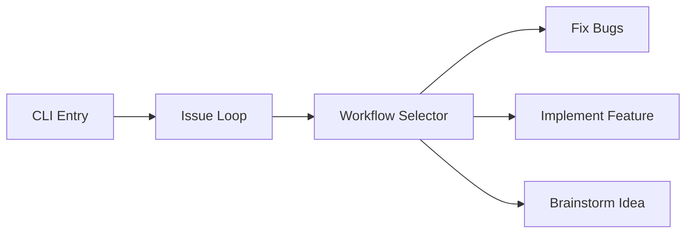
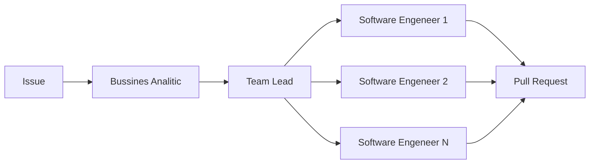
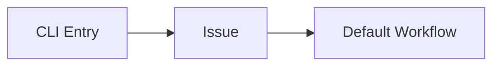
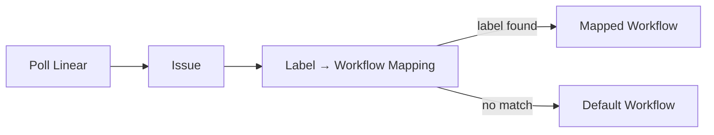
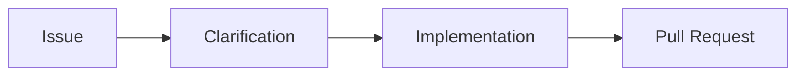

# Iron-pess

## Цели

Основная - сделать оркестратор с возможность гибкой настройки workflow через Web UI. Workflow это граф из нескольких типов узлов(AI-Agent/Bash-script/Pull Request/etc) и статусов.

CLI:

Role-based workflow:

Дополнительная - довести до состояния, когда можно развивать проект только через создание задач в трекере. 

## Что успели реализовать:
 - CLI в котором обрабатывается только одна задача

 - Polling-режим с автоматическим выбором workflow по лейблам Linear-задачи

 - Простейщий Workflow без сложной ролевой модели

 - Web UI в котором можно редактировать workflow и выгружать его ввиде json

## Технологический стек
JS/TS/Claude Code/ReactFlow/Linear
 
## Сложности:
 - Выбрать направление куда двигаться в сжатые сроки
 - Как лучше передавать состояние и артифакты внутри workflow
 - Как показывать текущее состояние workflow в UI
